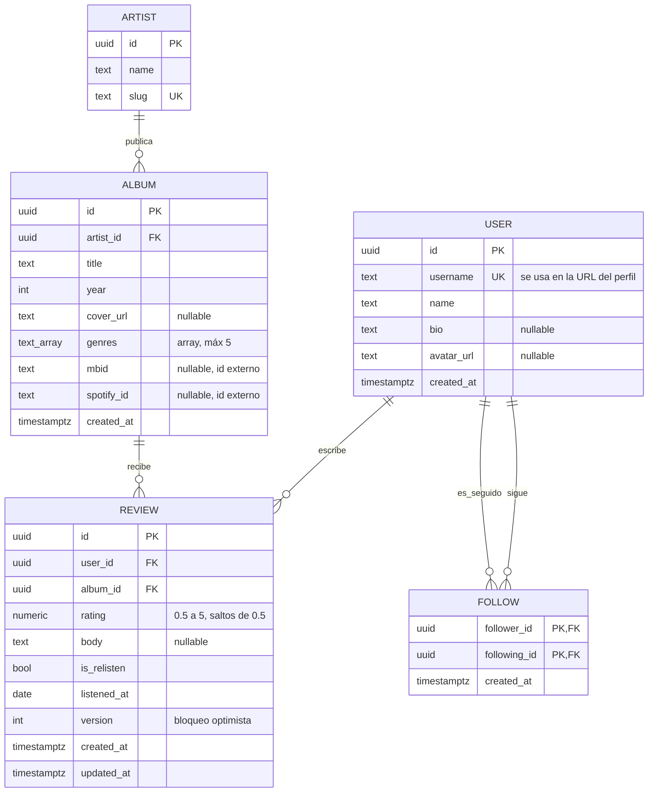

# Modelo de datos

## Convenciones

- PK: `uuid`
- Toda tabla lleva `created_at`
- Toda entidad editable lleva `updated_at` y `version` (bloqueo optimista → 409)
- Los géneros son un array en `albums`. No son tabla porque no se administran:
  solo se usan como filtro. Si alguna vez hay que editarlos, se normalizan.

## Decisiones del modelo

| Decisión | Por qué |
|----------|---------|
| `REVIEW` es la tabla intermedia N:M entre user↔album | En cuanto la intermedia tiene datos propios (puntuación, texto, fecha) deja de ser un detalle técnico y se vuelve la entidad central del dominio |
| Único `(user_id, album_id)` | Traduce a la base de datos la regla "una calificación por usuario por álbum". Sin esto, un doble clic crea dos reseñas |
| El promedio **no** se guarda en `albums` | Es dato derivado. Guardarlo obliga a recalcularlo en cada escritura y a mantenerlo consistente. Se calcula al leer |
| `FOLLOW` con dos FK a `USER` | Relación de una tabla consigo misma. PK compuesta `(follower_id, following_id)` para que nadie siga dos veces a la misma persona |
| `genres` como array, no como tabla | No se administran ni tienen atributos propios. Normalizarlos añadiría dos tablas sin beneficio |
| `mbid` y `spotify_id` nullable desde el inicio | No cuestan nada ahora y evitan una migración si alguna vez se enlaza con una API externa |
| `rating` como `numeric`, no `int` | Las medias estrellas son parte del dominio. Guardar décimas y dividir escondería el modelo |

## Borrado en cascada

| Relación | ON DELETE | Por qué |
|----------|-----------|---------|
| `review.user_id` → `user` | CASCADE | Si se va el usuario, se van sus reseñas con él |
| `review.album_id` → `album` | RESTRICT | No borrar un álbum con reseñas: es el historial de alguien |
| `album.artist_id` → `artist` | RESTRICT | No borrar un artista con discografía |
| `follow.*` → `user` | CASCADE | La relación no tiene sentido sin sus dos extremos |

## Índices (entrega 2)

- `review (user_id, album_id)` único — la restricción principal
- `review (album_id)` — para calcular el promedio de un álbum
- `review (user_id, created_at DESC)` — el perfil ordenado por recientes
- `album (artist_id)` — discografía
- `album USING gin (genres)` — filtro por género
- `user (username)` único — resolver el perfil desde la URL

> Nota: en el diagrama, `genres` aparece como `text_array` porque Mermaid no
> siempre acepta la sintaxis `text[]`. En Postgres el tipo real es `text[]`.